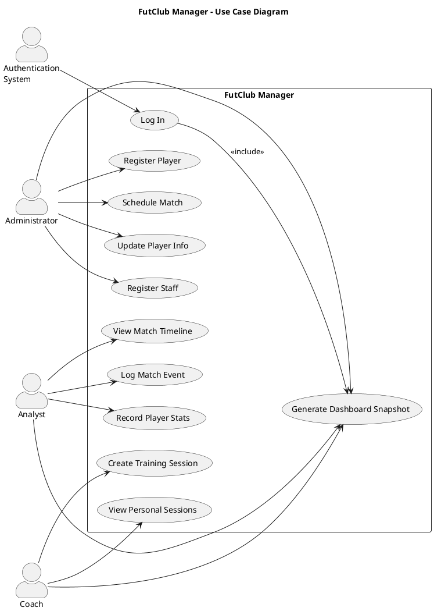

# FutClub Manager

Club operations suite built with a Java 17 Maven multi-module stack. The **backend** module exposes services for administrators, coaches, and analysts backed by SQLite, while the **frontend** module delivers a JavaFX desktop UI that consumes those services through a lightweight facade.

## Features
- Role-aware authentication (administrator, coach, analyst) with staff linkage
- Player management: registration, updates, roster overview
- Match workflow: schedule fixtures, log in-game events, view timelines
- Training operations for coaches: create sessions, review personal schedule
- Analyst tooling: match event capture, player performance stats entry, and top scorers/rated players view
- Dashboard snapshot summarizing squad, fixtures, and sessions

## Tech Stack
- Java 17, Maven 3.9+
- JavaFX 21 (via `org.openjfx:javafx-controls` and `javafx-fxml`)
- SQLite 3 (through the Xerial JDBC driver)
- JUnit 5 for backend tests

## Prerequisites
1. **JDK 17** on your PATH (`java -version` should report 17.x).
2. **Apache Maven 3.9+** (`mvn -version`).
3. No extra database install is required—the app creates `futclub.db` automatically in the working directory on first run.

## Project Layout
```
FutClub-Manager/
├── pom.xml                  # Parent aggregator
├── backend/                 # DAO + service layer (jar)
│   └── src/main/java/...    # Database + service code
├── frontend/                # JavaFX UI module (jar)
│   └── src/main/java/...    # UI + backend facade
└── futclub.db              # SQLite file (created in working directory at runtime)
```

## Building & Running

1. **Clean install all modules** (needed the first time or after backend changes):
	```bash
	mvn clean install
	```

2. **Launch the JavaFX application** (from repo root):
	```bash
	mvn -f frontend/pom.xml -DskipTests javafx:run
	```

3. **Frontend-only rebuild** (after UI changes):
	```bash
	mvn -pl frontend -DskipTests package
	```

4. **Backend-only rebuild** (after DAO/service edits):
	```bash
	mvn -pl backend -DskipTests package
	```

## Database Notes
- Schema and seed scripts live under `backend/src/main/resources/database/`.
- On first run `DatabaseInitializer` applies the schema and loads sample users:
  - `admin.wilson / password123`
  - `coach.smith / password123`
  - `analyst.jones / password123`
- The SQLite file (`futclub.db`) is created in the working directory on first run; delete it to reset the environment.

## Use-Case Diagram
Render the PlantUML snippet below (e.g., https://www.plantuml.com/plantuml/). It captures the primary actors and their supported actions within FutClub Manager.



## Testing
- Backend tests (DAO/service level): `mvn -pl backend test`
- Frontend currently manual (JavaFX UI); consider TestFX or screenshot testing if automation becomes a priority.

## Contributing
1. Fork and clone the repo.
2. Create a feature branch (`git checkout -b feature/xyz`).
3. Ensure `mvn clean install` passes.
4. Submit a PR describing your changes + screenshots when UI-related.

---
Questions or suggestions? Open an issue in the repo or drop a note in this workspace.